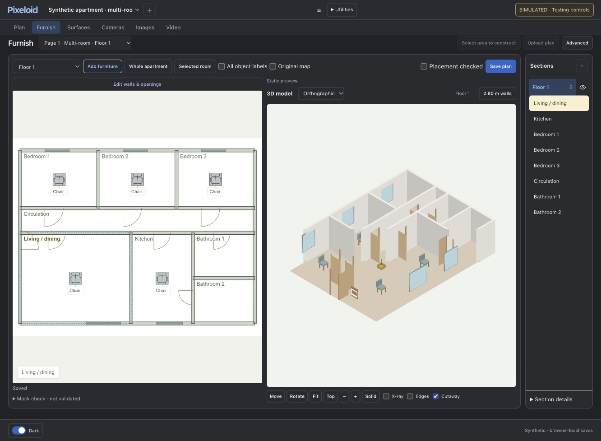

# Cutaway crash and rendering correction

Surface appearance controls previously called themselves again whenever entering 3D failed and no viewer existed. A rejected preview could create an unbounded asynchronous retry loop. These controls now attempt to open 3D once, suppress concurrent attempts, release their busy flag on failure, and retain the editable 2D view with an unavailable-preview message. A subsequent explicit click can retry. An existing hidden viewer also requires successful 3D entry before changing its display settings.

Two independent rendering issues were corrected:

- Cutaway classified individual triangle centroids, leaving arbitrary triangular remnants and uncut horizontal caps. It now clips wall polygons against a common vertical section plane and retains source edge masks.
- Selected-room framing reused the small room radius for the whole apartment's GPU depth range. Distant walls were clipped even with Cutaway off. Rendering now fits its depth range to the projected geometry while retaining the selected room's screen framing.

## Verification

Six Node suites passed: cutaway geometry/depth, failed Surface appearance/recovery, model viewer, walk view, Surface view navigation, and direct-object editing. Tests include alternate triangulations, cap clipping, opposite directions, nonmutation, furniture retention, failure attempt count, duplicate clicks and recovery.

In a separate local synthetic browser preview:

- Applied a finish, saved and refreshed, then clicked Cutaway with no viewer and a changed static fixture. The preview rejected the live rebuild once; the page remained responsive, reported the limitation and allowed switching to Floors. No edits were lost.
- Opened the multi-room fixture; checked Cutaway on/off, selected-room and whole-apartment framing, and Orthographic/Perspective controls. The previous distant-wall triangular fragments disappeared. No application console errors or WebGL context loss were observed.

Cutaway is a display section, not an edit to saved walls. Door/window objects and decor remain visible as context; section faces are not newly capped solids. This is synthetic browser verification, not proof of live backend geometry rebuilding or inference. Existing Mac/PC deployment, private projects, approvals and generation allowances were unchanged. The user's tab was not reset or reloaded.
