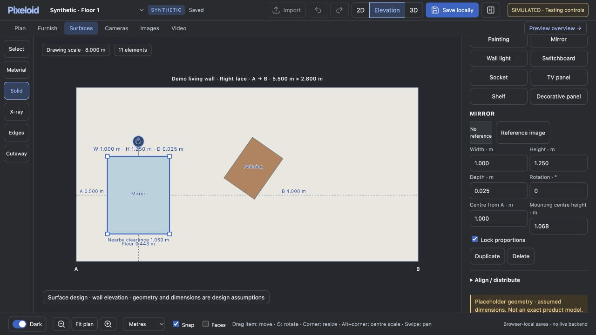

# Direct item editing and proportions lock

The Surface editor now exposes its item catalogue directly. Drag an item to move it, drag its round rotation handle to rotate, and drag any of its four square corner handles to resize. Normal corner resizing anchors the opposite corner. Option/Alt + corner drag keeps the item centre fixed. The visible **Lock proportions** checkbox preserves the current width/height ratio for both corner drags and exact size entry, including items without reference images. Turning the lock on does not resize the item. Unlock it for independent width/height changes. The setting uses the existing saved Surface reference metadata and survives save/reload.

Furniture also opens its catalogue by default and uses direct body movement and an on-object rotation handle instead of Move/Rotate modes. Its existing proportional corner resizing now supports Option/Alt centre anchoring. Furniture retains its existing modular seat/row edge controls; the new explicit lock switch is in the Surface item inspector.

The viewer coalesces resize notifications, cancels pending work on disposal and limits the high-DPI drawing buffer to approximately two million pixels. This bounds rendering resource use. It does not prove the cause of the user's repeat browser crash: the existing crashed tab could not supply diagnostic logs and was left untouched. The earlier one-attempt Surface preview failure guard remains in place.

## Verification

Eight Node suites passed: corner scaling/proportion lock, viewer lifecycle, Surface appearance failure/recovery, Surface edit reliability, Surface geometry, model viewer, direct object editing, and furniture library (including 936 proportional-resize cases).

An isolated browser-local synthetic preview verified:

- Four visible Surface corner handles; direct body movement and rotation without mode buttons.
- Option/Alt corner resizing retained the centre; pure geometry tests also cover opposite-corner anchoring at four rotations and all four corners.
- Locked width entry changed 0.600 × 0.900 m to 0.800 × 1.200 m.
- Unlocked height entry changed that to 0.800 × 1.000 m without changing width.
- Relocking did not change dimensions. Option/Alt dragging produced 0.972 × 1.215 m with the same centre and ratio; locked height entry then produced 1.000 × 1.250 m.
- Lock, dimensions and both Surface items persisted after save/reload.
- The always-visible Mirror tile placed a second Surface item; direct Painting rotation reached −35°.
- Furniture rotation by the on-object handle updated the 2D symbol and both angle fields (25° → 42°).
- 24 rapid Surface display-mode clicks after a changed static fixture, and 24 Furniture Cutaway/Edges/X-ray changes: responsive UI, no application console errors; Furniture WebGL context remained available.
- Surface/Furnish navigation retained the synthetic edits.

## Limits

This is synthetic frontend verification, not evidence of live backend geometry rebuilding or image/video generation. Static 3D previews cannot rebuild edited structure; unsupported rebuilds remain clearly reported without retry loops. No inference, model operations, PC endpoints, private project data or generation allowances were used or changed. The Mac/PC deployment was not restarted. The user's crashed tab and browser-local data were not reset. These checks do not guarantee recovery of edits that were unsaved before the browser crash.
