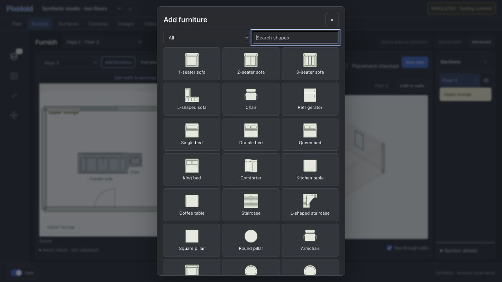
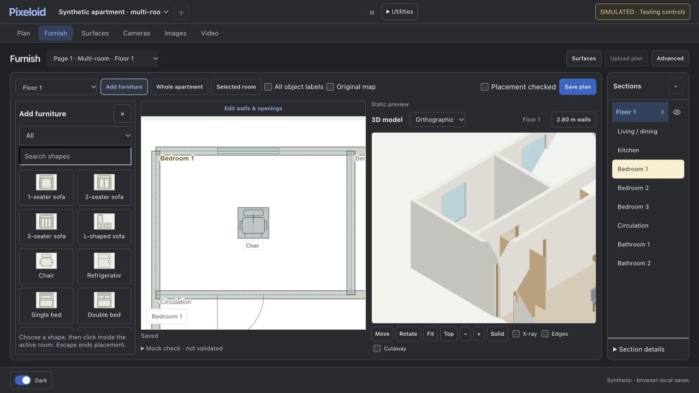
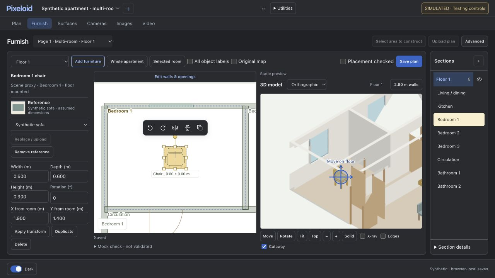
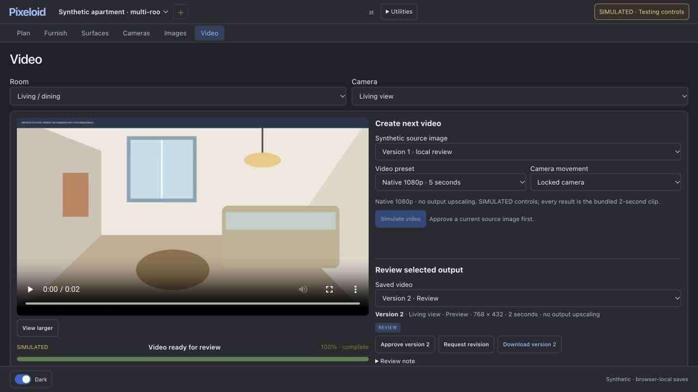
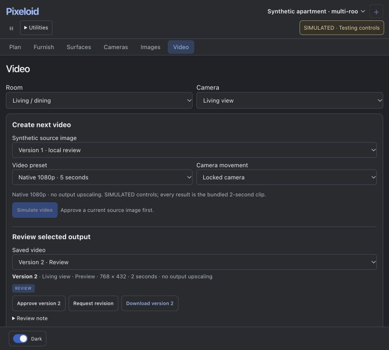

# Consolidated editing workflow — ui8

[Open the synthetic multi-room preview](https://maninder-singh-bali.github.io/ps/?preview=ui8&project=synthetic-ui&stage=furnish&scenario=multi-room). In Testing controls, choose **multi-room → Load scenario**. This explicitly opens a separate browser-local dataset; it does not replace previous basic-scenario work. No login is needed. The deployed `preview-manifest.json` records the exact source commit.

## What changed

Saved editor context now retains the selected object and room focus. Surface editing uses the shared room selection, scopes eligible hosts to that room, and tests wall/room intersection rather than only wall midpoints or endpoints. This matters when one continuous wall spans several rooms. Surface focus uses the scene coordinate origin, fixing the blank 3D viewport seen during this acceptance pass. Plan and Surface tool instructions and elevation availability agree with the active workspace.

3D manipulation handles now remain usable when their projected centre falls over empty space or an occluding face. Surface rotation works in 2D as well as 3D. Selected-object references and proxy transforms occupy the first inspector section; product evidence and optional instructions stay secondary. Catalogue filters persist. Failed reference assignments restore the previous choice with feedback, and proxy scale controls preserve reviewed product evidence.

The public adapter has separate basic and multi-room storage, protects against delayed writes crossing scenarios, and preserves room context across Plan/Surfaces. Its testing dialog stays in the foreground when the header is rebuilt. Video job progress sits below the player so version-specific review actions remain visible at laptop height; narrow layouts put creation and review before the player.

## Acceptance checklist

“Verified real copy” means browser interaction against the actual local backend and a disposable copy of the apartment. “Verified synthetic” means browser interaction against browser-local mocks. Neither means inference was run.

| Requirement | Implementation and verification |
| --- | --- |
| Room IDs, boundaries, 2D/3D focus, rapid selection | **Implemented; verified real copy and synthetic.** Clicked all 16 private sections and all 16 synthetic rooms across two floors. Rapid selection settled on the last room. Whole apartment and Selected room produced distinct framing. |
| Stage/tool/input agreement | **Implemented; verified.** Plan wall tool reports wall drawing; Surfaces reports face/item editing and exposes relevant tools. Floor/ceiling elevation is disabled with a reason. Camera → Surface and Back/Forward were exercised without freezing. |
| Context, reload, unsaved navigation | **Implemented; verified.** Room and selected furniture persisted across Furnish/Surfaces/reload. The public Bedroom 1 context survived Back/Forward. Dirty real furniture prevented stage navigation with a Save-edits message. Escape in a numeric input retained selection. |
| Direct 3D selection and movement | **Implemented; verified real copy.** A 3D chair click selected its corresponding 2D record/reference. Floor-plane translation and rotation to 45° were saved. One undo restored the prior rotation; redo restored 45°; Escape cancelled an unfinished translation. |
| Wall/ceiling host constraints | **Implemented; verified real copy.** Wall artwork moved directly in 3D from 88 to 98.615 inches along its host, then undo restored 88. Ceiling movement changed its surface-local position while retaining its host and 18-inch drop. 2D wall rotation and undo were also exercised. |
| Catalogue and placement | **Implemented; verified real copy.** Added a chair, observed the placement preview/repeated-placement mode, placed in 2D, dragged it, cancelled placement with Escape, and closed the catalogue. Synthetic search `chair` survived reload. |
| Reference assignment and evidence | **Implemented; verified real copy.** Uploaded a bundled synthetic reference to the new chair and reopened it with the same reference identity. Explicitly applied reviewed 24-inch width, then independently resized the proxy to 26 inches; product evidence remained 24 inches. |
| Invalid placement | **Implemented; verified real copy.** A 9999-inch width was rejected with an instruction to keep the footprint inside the selected room. The valid saved chair was retained. |
| Surface workflow | **Implemented; verified real copy and synthetic.** Room → kind → face → Material/Items, actual item selection, wall elevation, ceiling drop, 3D movement, saved room-bound floor finish. Synthetic wood finish at 0.3 m scale survived reload; a continuous wall face spanning rooms was picked successfully. |
| Compact inspector | **Implemented; visually verified at 1280×720.** Reference identity, proxy dimensions, position/rotation, Apply, Duplicate and Delete are visible together. Product metadata remains expandable. |
| Solid/X-ray/Edges/Cutaway | **Preserved; verified.** Explicit Cutaway preference survived refresh. Offline scene snapshots confirmed view preferences do not invalidate physical inputs. Existing seam/coverage regression suites passed. |
| Layout/theme/focus | **Verified** at 1280×720, 1366×768, 1440×900 and 800×720. Dark/Light switched correctly; no document-width overflow in measured layouts. Narrow workspaces scroll vertically; keyboard focus brought review controls into view. Video review buttons fit at laptop height. |
| Cameras/review/video | **Verified synthetic; private camera records unchanged.** Switched Living/Detail saved camera views and saw explicitly static preview messaging. Approved a synthetic image, observed the label change, ran simulated completion, cancelled another local job, recovered it, reloaded/reconnected, exercised failure and recovery, and retained version-specific review/download actions. |
| Save faults | **Verified synthetic.** Rejected and conflicting saves retained a 20° unsaved chair edit. Delayed save reported Saving then Saved and reopened with 20°. Disconnected mode reported edits preserved; Reconnect restored mock connectivity. |
| Saved records/shared scene/offline inputs | **Verified real copy.** Canonical chair transform, surface host/position/drop and reference identity matched saved records and shared scene manifests. Three surface-reference files matched their saved byte hashes. Furniture and surface changes invalidated scene snapshots; view preferences did not. |
| Original deployment/data | **Verified preserved.** Original application source hashes and 16 original project/draft JSON hashes were unchanged. Saved camera records were unchanged. No original output, approval, phase, allowance or service was modified. |
| Representative public fixture | **Implemented; verified synthetic.** Explicit opt-in apartment has living/dining, kitchen, three bedrooms, two bathrooms and circulation on each floor, separate IDs/boundaries, openings, distributed chairs, wall artwork and a ceiling pendant. Existing basic fixture remains available, including its rounded-corner example. |

## Regression checks actually run

- **94 Python tests:** furniture blocks/meshes, surface design and input preparation, scene control/evolution, shared-floor health. All passed. Two existing image-file ResourceWarnings did not fail the suite.
- **10 Node suites:** model viewer, direct object editing, furniture library, walk view, surface geometry, surface edit reliability, Surface view navigation, furniture startup, workspace selection and selected-floor reopening. All passed.
- **Video preset suite** passed after the video layout change.
- **14 staging-adapter groups** passed, including two-floor state, Plan persistence, furniture references/transforms, cameras, image review/masks, simulated jobs, fault injection, opt-in namespace preservation and stale in-flight write rejection.
- Browser checks above used actual clicks, typing, pointer drags, undo/redo, history and refresh. Buttons merely existing were not counted as successful interactions. Final checked browser pages reported no application console errors.

## Before / after

Earlier synthetic catalogue capture from the preceding review:

Current non-modal catalogue beside the working canvas:

Current compact inspector:

Video review at 1280×720 and 800×720:

Private apartment screenshots, canonical manifests and diagnostic guide files remain in the local verification folder and are not published.

## Limits and blocked external validation

- **Generation-ready guide remains gated:** Bedroom 1 has no saved camera; the existing living view requires placement review. A read-only diagnostic image used the existing camera and actual shared geometry, but it is not a generation-ready or approved guide. No gate was bypassed.
- **Public backend/geometry/inference validation is unavailable by design.** Pages contains production browser components plus a staging-only adapter. Architecture and camera images are static fixtures. Furniture proxies update locally; Surface changes persist, but a changed architecture/Surface 3D rebuild is explicitly unavailable. Mock saves, reviews, collision checks and simulated jobs do not prove production backend or generation correctness.
- The real backend currently restricts one reference asset to one furniture instance in a room. A second assignment is rejected; use a separate upload for a second instance. This pass makes that rejection safe and clear, without changing the backend data model.
- Room focus uses saved section extents, not certified room boundaries. Continuous wall faces can extend beyond one room; inspect the face span before placing items. A boundary derived from a room extent is explicitly marked for review.
- Product meshes remain proxies. Collision feedback is not structural/clearance certification. Unhosted legacy items are not assigned arbitrary hosts; wall-mounted furniture cannot rotate away from its host. Multi-object 3D furniture manipulation is not included; existing Surface selection/alignment remains available.
- At narrow widths, inspectors use vertical scrolling. This is a desktop editing build, not a touch-phone workflow. External product lookup and exhaustive arbitrary geometry cases were not tested.
- The existing Mac/PC deployment is unchanged. These code changes were tested in the isolated copy and published as code plus the synthetic preview. No PC access, model operation, inference attempt, production approval or allowance change occurred.
