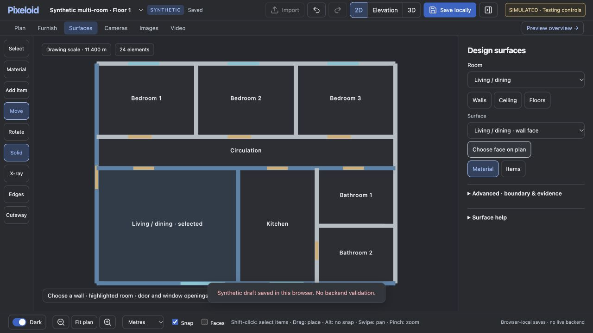
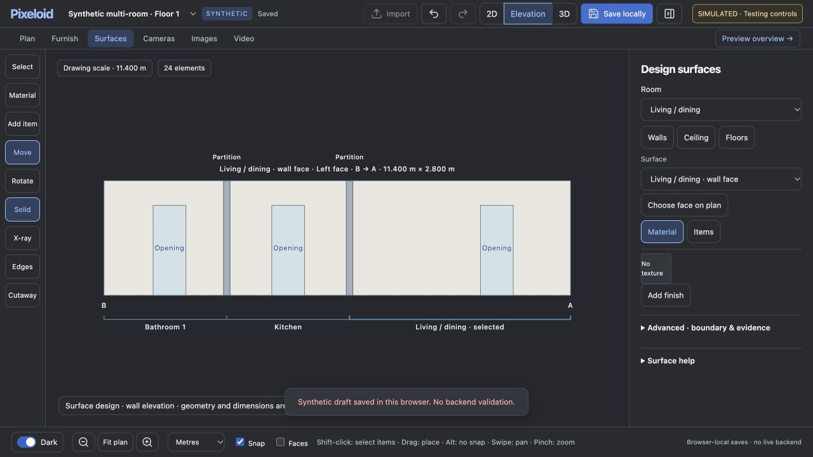

# Room partition visibility fix

Surface face selection now includes labelled room boundaries, a selected-room highlight, and hosted door/window openings. Fit shows the complete floor so adjoining partitions remain visible.

Continuous wall elevations include the actual intersecting partition thickness and height, plus room-span brackets derived from saved room boundaries. Partitions on the opposite face are dashed and explicitly labelled. New canvas face selections choose the side facing the selected room when its saved boundary identifies one side. Previously saved faces and items are not remapped.

These are view-context annotations: they do not split walls, change aperture dimensions, relocate items, add collision validation, or certify saved room boundaries. If a room has only a saved bounding box, its span uses that extent. Unsupported gaps are not bridged. Continuous hosts remain full-length and item X stays measured from the original wall A.

## Verified

- Four passing Node suites: surface geometry, view navigation, edit reliability, and partition context. Context cases cover same/opposite side, absent/gapped/parallel walls, reversed host direction, angled hosts, room spans, and no geometry mutation.
- Isolated synthetic browser: full-floor overview has eight room labels; selected Living/dining highlights correctly. Selecting its shared hall wall shows partitions at 5.4 and 8.4 metres from A, all three existing openings, and separate Living/dining, Kitchen and Bathroom 1 spans.
- Creating the room-facing surface, undo, redo, local save and refresh preserve the selected face and annotations. Metres/feet and Light/Dark were checked at 1280×720.
- Floor 2 also shows eight distinct upper-floor rooms after re-entering Surfaces. Existing limitation: changing the saved floor while Surfaces is open returns to the structure inspector; click Surfaces again.
- No application console errors in the test tab.

This verification uses the production browser components with synthetic browser-local data. It does not establish production backend validation or a live shared-scene/3D rebuild. The Mac/PC deployment, private project files, credentials, inference, approvals and allowances were untouched. The user's existing unsaved browser tab was not reloaded or reset.
