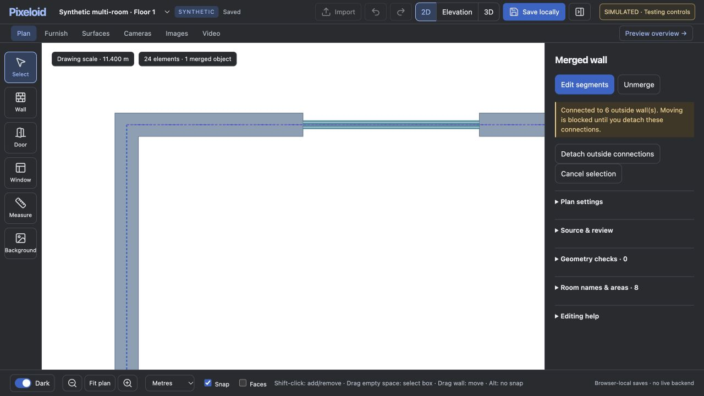

# Joined wall preview after merge and editing

The staging `/resolve` response used a precomputed joined footprint only while the complete draft matched its original fixture. Merging changed metadata and triggered a fallback of independently stroked rectangular strips. This left the outside corner quadrant empty and drew internal seams despite shared topology. Thickness or endpoint edits took the same fallback.

The synthetic adapter now always derives the 2D outline in the browser: exact line intersections, offset-face sectors, bounded mitres/bevels, opening cuts and polygon union. Offset construction mirrors `wall_junctions.py`; the MIT polygon-clipping 0.15.7 distribution is bundled locally with license notices. No CDN, worker or production API is contacted. The result leaves editable reference lines and topology unchanged. Intentional gaps remain open. A merged object still cannot move away from attached outside walls without an explicit detach.

## Verification

- 30 synthetic cases compare browser-derived polygon area and symmetric difference with the production Python 2D resolver: acute/obtuse/right-angle corners, unequal thicknesses, T and cross intersections, collinear and overlapping walls, intentional gaps, opening cuts, enclosed holes, metadata-only merge, and all four basic/multi-room floor fixtures including the rounded corner. All match within 0.00001 source-pixel square area and source features remain unchanged.
- Eight existing Python wall-junction tests and the merged-object/editable-junction Node suites pass.
- In a separate browser-local preview, merged the multi-room example's north and west walls exactly as in the reported screenshot. The SVG outline and hash remained identical before/after merge, after undo/redo, and after saving/reopening. Changed north-wall thickness from 0.160 m to 0.240 m: outline rebuilt, shared endpoints remained connected and the outside corner stayed filled. No browser application errors were observed.

## Limits

This repair is confined to staging transport and 2D previews. It is not proof of production backend validation, live 3D rebuilding or inference. The static 3D fixture limitation is unchanged. Browser resolution is bounded to 400 wall pieces / 4,000 intersections, with a clear error above those limits. The existing Mac/PC deployment, private plans, source dimensions and generation allowances were untouched. The user's unsaved browser tab was not reloaded or reset.
